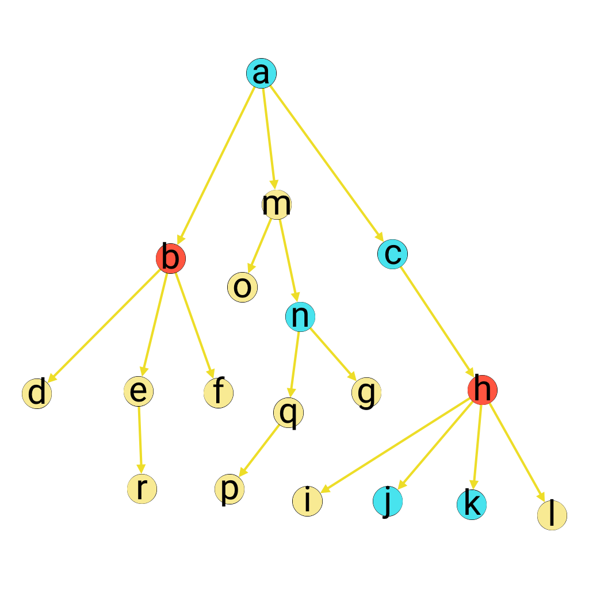
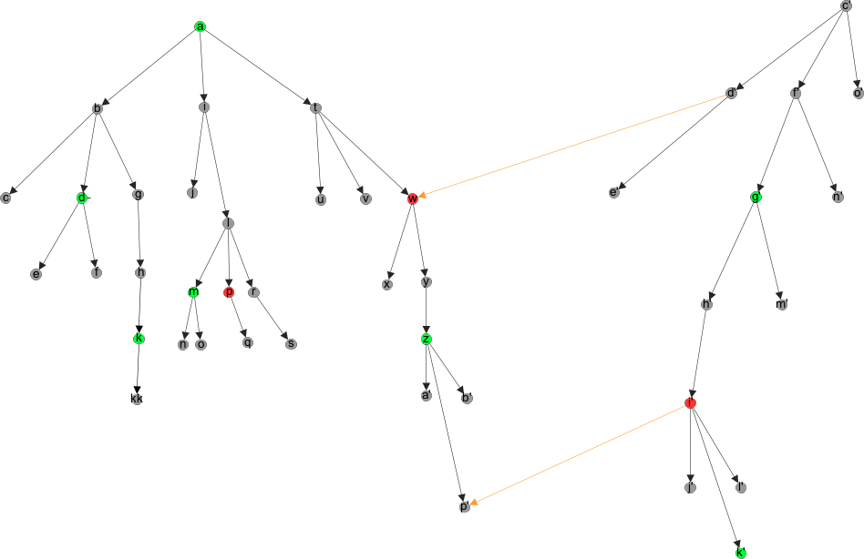

# polygam

TL;DR:

> Choose as many spouses as you want according to your taste.


This description above (about spouses) is actually rather accurate but it would
be easier to explain it with trees, colours and arrows.

You are given two trees (aka directed acyclic connected graphs), A and B. Each
vertex of tree A has veen give some 'gutt', that's to say a set of logical
rules. The gutt of a node from A defines which vertices of B are available for
it. In the same way, each vertex of B has some gutt which define which vertices
of A are available for it.

My goal in this project is to write such a function `availableo` which takes a
vertex from a tree and returns all available vertices of the other tree. It's
really a perfect playground for logic programming.

> End of TL;DR

Let me say it another way: a vertex from a tree is somehow linked to some set of
vertices of the other tree. A vertex and its linked set can't be from the same
tree.

This project currently barely stands as a draft which I'm working on during my
spare time. I've found useful to see this problem from different viewpoints,
hence you can still find vocabulary about genealogy, graph, match-making, logic
and relational algebra.

I've found both necessary and educational to keep attaching documentation to my
side projects for it helps to more clearly define your goals and where you are
in relation to them. The [changelog](CHANGELOG.org) aims at keeping an
up-to-date history of what has been done and what is left.

Once redacted, this document will introduce the problem and the tools I've
defined through a running example. This kind of literate programming should make
very easy to understand the code. However, this is not an introduction from
scratch. You can look up on the fly for the definition of things you don't know:

* What is [a graph](https://en.wikipedia.org/wiki/Graph_(discrete_mathematics))
* Learning [logic programming](https://mitpress.mit.edu/books/reasoned-schemer)
* Getting started with
  [`core.logic`](https://github.com/swannodette/logic-tutorial)
  ([code here](https://github.com/clojure/core.logic))

## Tools

In this section we define the current semantic of goals then we give some
examples of expected behaviours.

### Definitions

Consider the following tree, which arrows are from top to bottom.



Each arrow stands for the parent / child relation. It's defined in the code by
the relation `child`. We can extend this relation to ascendant / descandant:
it's the relational goal `kino`. Logic goal are used to be suffixed with a
superscript `o` (or another vowel), which we render in the code by a standard
letter `o`. The name `kino` comes from English nouns kin and kinship which
denotes such a relationship. Last word about the family, you can access siblings
of a vertex (other children of the same parents different from the given vertex)
by goal `siblingso`.

Vertices can be elicited or rejected. Two relations embodie this is the code.
Their names are pretty straightforward as `yap` convey a positive meaning
(chosen amongst siblings) whilst `yuk` sounds negatively yucky. Ikks! The goal
`yap-treeo` accepts any node which is elicited or which descend from an elicited
node. `yuk-treeo` is the symetric goal which can accept any rejected (yukked)
vertex of any children of such a vertex.

Some subtlety appears when intertwin yukked and yapped vertices.

### Simple visual example

Consider the same graph.

Vertices `a`, `b`, `c`, `h`, `j`, `k` and `n` have been added some marks. Nodes
`a`, `c`, `j`, `k` and `n` are marked with blue, meaning they have been elicited
(yapped). Others are explicitly rejected.

Let's describe the expected behaviour of the code: what will it reply to the
question "Which nodes are available"?

* Node `a` is in blue then it's available
* `a` has three children: `b`, `m` and `c`. Node `b`is explicitly rejected then
  is coloured in red. Node `m` should be available but node `c` has been
  explicitly chosen so it has precedence: node `m` is not available and node `c`
  is available.
* => so far, available nodes are `a` and `c`
* Node `b` is explicitly rejected so are its children. Neither `d`, `e`, `f` or
  `r` will be available.
* => so far, available nodes are still `a` and `c`
* Node `m` is not available and node `o` is a regular node so is not available
  either. However, node `n` has been explicitly chosen so is available. The
  descandants of node `n` are also available because none of them has been
  rejected or elicited against another one.
* => so far, available vertices are now `a`, `c`, `n`, `q`, `g` and `p`
* Node `c` is available so it child `h` should also be, however the latter node
  has been explicitly rejected. No vertex is added.
* Children of an explicitly rejected node should not be available, however `j`
  and `k` have been explicitly chosen so they are available.
* => finally available vertices are `a`, `c`, `n`, `q`, `g` and `p`

When looking for general answer, which are available nodes to be chosen? This is
left as exercise for the reader.


### Step-by-step examples

The two strategies presented here are explained with the help of the following graph.

* The [substraction](./docs/substraction.md) algorithm uses soft-cut strategy to
  remove values from the initial set untill it matches the answer.
* The [accumulation](./docs/accumulation.md) algorithm uses logical disjunction
  to unfold possible case and accept or reject values.



## Performance

Last but not least word about performance: the two strageties implemented here give:

``` Clojure
"Elapsed time: 949.399797 msecs" ;; accumulation
"Elapsed time: 979.701262 msecs" ;; substraction
```

Methinks it's important to keep in mind computation time is rather sensitive to
the complexity of the problem you want to solve. For example, if you forbid a
graph to be inconsistent, elapsed time will substantially shrink:

``` Clojure
"Elapsed time: 633.909367 msecs" ;; accumulation
"Elapsed time: 432.91587 msecs"  ;; substraction
``` 

Computation time can be further reduced with the asumption of rooted tree.

## Thanks

* William E. Byrd
* Any other people cited in his dissertation

## License

Copyright © 2016 piotr-yuxuan

Distributed under the GNU General Public License either version 3.0 or (at your
option) any later version.
