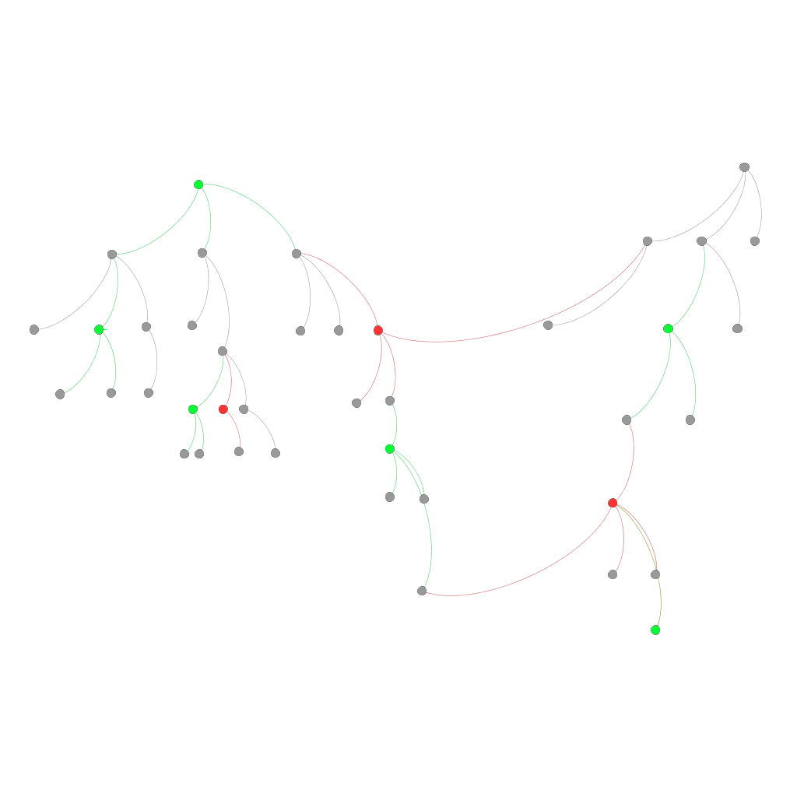

# polygam

TL;DR:

> Choose as many spouses as you want according to your taste.


This description above (about spouses) is actually rather accurate but it would
be easier to explain it with trees, colours and arrows.

You are given two trees (aka directed acyclic connected graphs), A and B. Each
vertex of tree A has veen give some 'gutt', that's to say a set of logical
rules. The gutt of a node from A defines which vertices of B are available for
it. In the same way, each vertex of B has some gutt which define which vertices
of A are available for it.

My goal in this project is to write such a function `availableo` which takes a
vertex from a tree and returns all available vertices of the other tree. It's
really a perfect playground for logic programming.

Last word about not least performance: the two strageties implemented here give:

- Wrapped by `doall`:
``` Clojure
"Elapsed time: 324.399578 msecs"
"Elapsed time: 299.373844 msecs"
```
- Wrapped by (map identity):
``` Clojure
"Elapsed time: 9.429092 msecs"
"Elapsed time: 8.881946 msecs"
``` 
> End of TL;DR

Let me say it another way: a vertex from a tree is somehow linked to some set of
vertices of the other tree. A vertex and its linked set can't be from the same
tree.

This project currently barely stands as a draft which I'm working on during my
spare time. I've found useful to see this problem from different viewpoints,
hence you can still find vocabulary about genealogy, graph, match-making, logic
and relational algebra.

I've found both necessary and educational to keep attaching documentation to my
side projects for it helps to more clearly define your goals and where you are
in relation to them. The [changelog](CHANGELOG.org) aims at keeping an
up-to-date history of what has been done and what is left.

Once redacted, this document will introduce the problem and the tools I've
defined through a running example. This kind of literate programming should make
very easy to understand the code. However, this is not an introduction from
scratch. You can look up on the fly for the definition of things you don't know:

* What is [a graph](https://en.wikipedia.org/wiki/Graph_(discrete_mathematics))
* Learning [logic programming](https://mitpress.mit.edu/books/reasoned-schemer)
* Getting started with [`core.logic`](https://github.com/swannodette/logic-tutorial) ([code here](https://github.com/clojure/core.logic))

## Tools

In this section we define the current semantic of goals then we give some
examples of expected behaviours.

### Definition

Consider the following tree, which arrows are from top to bottom.

Each arrow stands for the parent <~> child relation. It's defined in the code by
the relation `child`. We can extend this relation to ascendant <~> descandant:
it's the relational goal `kino`. Logic goal are used to be suffixed with a
superscript `o` (or another vowel), which we render in the code by a standard
letter `o`. The name `kino` comes from English nouns kin and kinship which
denotes such a relationship. Last word about the family, you can access siblings
of a vertex (other children of the same parents different from the given vertex)
by goal `siblingso`.

Vertices can be elicited or rejected. Two relations embodie this is the code.
Their names are pretty straightforward as `yap` convey a positive meaning
(chosen amongst siblings) whilst `yuk` sounds negatively yucky. Ikks!

Even if `yap` and `yuk` can't be used together yet in a coherent fashion, you
can still manipulate them separately with two goals `yap-treeo` and `yuk-treeo`.
The first one can return any vertex which has been elicited (yapped) or any
child of such a vertex. It means that ignored vertices, that's to say non-yapped
siblings of a yapped vertex can not be comprehended by `yap-treeo`. By the way,
forgive my poor ability to name things in proper English but such an ignored
vertex is said to be empeached. You can reach it through the relational goal
`empeachedo`.

`yuk-treeo` is the symetric goal which can accept any rejected (yukked) vertex
of any children of such a vertex.

Some subtlety appears when intertwin yukked and yapped vertices.

### Simple visual example

Consider the following graph.


Vertices `a`, `b`, `c`, `h`, `j`, `k` and `n` have been added some marks. Nodes
`a`, `c`, `j`, `k` and `n` are marked with blue, meaning they have been elicited
(yapped). Others are explicitly rejected.

Let's describe the expected behaviour of aforedefined goals:

 * `yap-treeo` allow nodes `a`, `c`, `n`, `q`, `g`, `p`, `j` and `k` since they
   all descend from `a` which has been elicited and are not being empeached.
   Vertex `m`, `i`, `l` and their children, if any, are ignored because of
   empeachement (for `m`, `i`, `l`).
 * `empeachedo` should hence return the previous ignores vertices: `m`, `i` and
   finally `l`.
 * `yuk-treeo` should match vertices `b`, `d`, `e`, `f`, `r`, `ì` and `l`
   because nodes `b` and `h` are rejected (yukked).

When looking for general answer, which are available nodes to be chosen? This is
left as exercise for the reader.


### Step-by-step example

The following lines will focus on the left 'visual' component of the graph.
Orange-coloured edges and nodes on their right are ignored for now has they add
some pointless complexity.



In this section, the relation `availableo` is constructed by step by
substraction. Each step takes builds on the result of the previous one. This
construction produces a non-relational goal. For the peace of the mind, another
way is possible (e.g. without `conda`).

The early version of this relation `availablero` binds the value of a logic
variable to all nodes which can are available for a given gutt and only these
nodes. How to get such a relation?

#### Step -1: Anything

```Clojure
(run* [q])
```
`=> (_0)` because there is no rule of constraint on the variable.

#### Step 0: all vertices

We use the facts defined in `definitions` as the definition of what a vertex is.

```Clojure
(with-dbs [definitions]
  (run* [q]
    (vertex q)))
```

`=> (:a :b :c :d :e :f :g :h :i :j :k :l :m :n :o :p :q)` all nodes are here.
I've added an implicit call to `sort` to make the result more human friendly.

#### Step 1: only keep vertices which are not explicitly rejected

Let's bind the logic variable to any node which has been explicitly rejected:

```Clojure
(with-dbs [definitions favour]
  (run* [q]
    (yuk q))))
```
`=> (:b :h)` it seems to work well, let's go further and use _negation as a
failure_ to retrieve all the values for which it's impossible to match the goal
`yuk`.
```Clojure
(with-dbs [definitions favour]
  (run* [q]
    (nafc yuk q))))
```
outputs something like `=> (_0)` because the logic variable can be anything,
provided that *anything* doesn't match the goal `yuk`. You need to narrow the
possible values of the logic variable to all vertices:
```Clojure
(with-dbs [definitions favour]
  (run* [q]
    (vertex q)
    (nafc yuk q))))
```
`=> (:a :c :d :e :f :g :i :j :k :l :m :n :o :p :q)` from which `:b` and `:h`
have been removed.

#### Step 2: go through sub-steps

A soft-cut strategy is applied: ask each possible value the question of the
sub-step: if it's a match then conditions apply and further questions are
ignored; if it's a miss, go to next step and repeat the process. If no sub-steps
are valid it fails. If one step is valid then further steps are ignored.

See `condo` in the Reasoned Schemer of `conda` in `core.logic`.

The final form of this step can be found in the code. Only simple sub-steps are
shown here.

#### Step 2.0: has this vertex been explicitly chosen?
```Clojure
(with-dbs [definitions favour]
  (run* [q]
    (yap q))))
```
`=> (:a :c :j :k :n)`

If yes, it succeeds without any conditions. Here, it means the logic variable
the goal `availableo` is dealing with will be able to take the value which
succeeds here.

#### Step 2.1: is this vertex free from impeachment?
```Clojure
(with-dbs [definitions favour]
  (run* [q]
    (vertex q)
    (nafc impeachedo q)))
```
If yes, it will succeed if and only if it's not a descandant of an explicitly
rejected node. In equivalent terms, it will succeed if and only if it's
impossible to find an explicitly rejected vertex whose this node descend from.

#### Step 2.2: is this vertex impeached?
```Clojure
(with-dbs [definitions favour]
  (run* [q]
    (vertex q)
    (impeachedo q)))
```
If yes, it's a fail.

#### Step 2.3: is this vertex son of both a rejected / impeached node and an elicited node?

The following code has been wrapped into a named goal: `son-of-yap-son-of-yuko`.
```Clojure
(with-dbs [definitions favour kin]
  (run* [q]
    (fresh [a b]
      (kino a q)
      (kino a b)
      (kino b q)
      (yuk a)
      (yap b)
      (l/!= a q)
      (l/!= a b)
      (l/!= b q))))
```
If yes, it succeeds.

#### Step 2.4: is it impossible to find an explicitly rejected vertex whose this node descend from?

```Clojure
(with-dbs [definitions favour kin]
  (run* [q]
    (vertex q)
    (nafc yuk-treeo q)))
```
If yes, it succeeds.

## Thanks

* William E. Byrd
* Any other people cited in his dissertation

## License

Copyright © 2016 piotr-yuxuan

Distributed under the GNU General Public License either version 3.0 or (at your
option) any later version.
